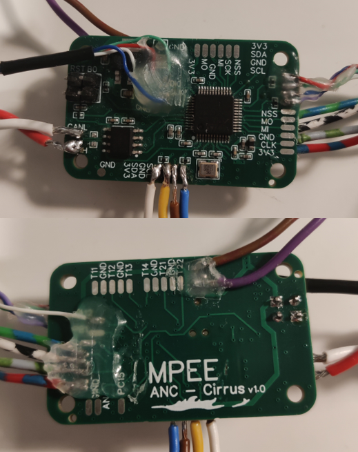
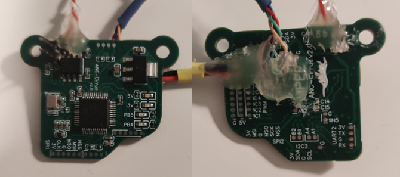

# Cirrus
Low-cost PCB for flight control and logging purposes for small UAV-s

For PCB design learning, and embedded programming

EasyEDA was used for the eCAD work

## V1

### Pinout

- STM32F103 microprocessor for control
- 12 MHz chrystal resonator (does not work on finished PCB)
- Debug tagconnector
- 5V to 3V3 LDO (AMS1117) for supply
- CAN transciever for the possibility to use multiple controllers in one vehicle to split up the tasks
- 6 PWM outputs for servo control
- 2 I2C interfaces exposed for connecting sensors
- 2 SPI interfaces exposed for connecting sensors
- 1 UART interface exposed for connecting sensors
- 1 ADC exposed for measurements (current etc.)
- PA4, PA12, PB1, PC15 exposed to be used as GPIO (interrupt pin)

### Interfaces
Interfaces exposed with pads for soldered wired connections.

### Manufacturing
4 layers with signal-ground-ground-signal

One sided assembly

## V2

### Pinout

- STM32L431 -> for more interrupts and DMAs
- 16MHz chrystal resonator (issues fixed)
- Debug changed for pads
- 6 PWM added 5V rail for power
- Power LEDs added
- User LEDs added

### Interfaces
Connection pads made smaller (made it very challenging to solder by hand)

Form factor changed to include two mounting holes aligned with conventional 30.5mm x 30.5mm flight controller pattern.

